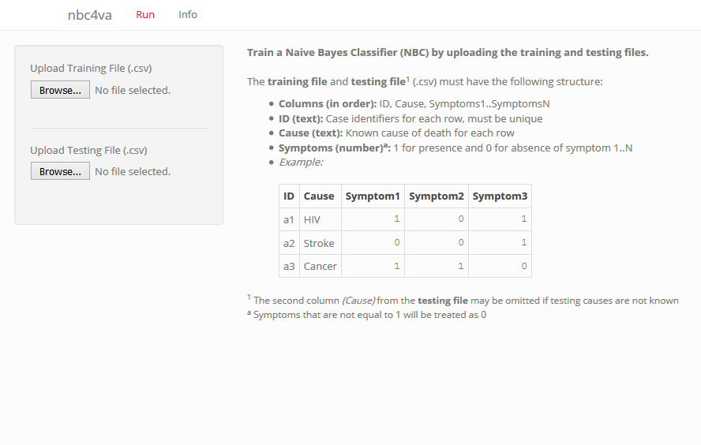
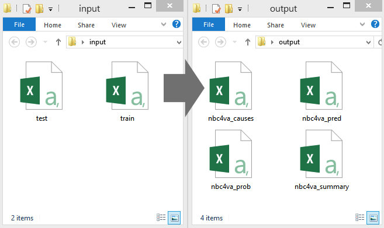
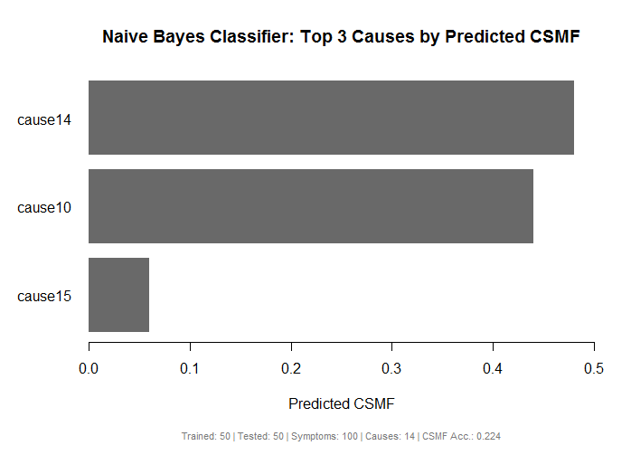
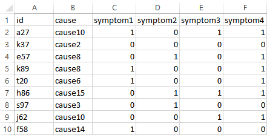
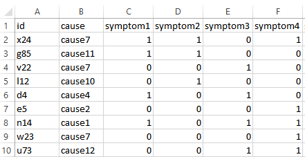
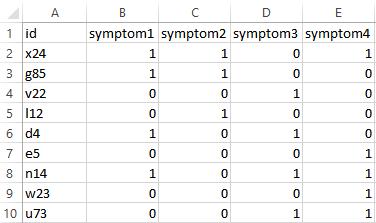

# Introduction

Richard Wen  
rrwen.dev@gmail.com  
  
The nbc4va package implements the Naive Bayes Classifier (NBC) algorithm for verbal autopsy data based on code and methods provided by [Miasnikof et al (2015)](https://bmcmedicine.biomedcentral.com/articles/10.1186/s12916-015-0521-2).

This package is intended to be used for experimenting with the NBC algorithm to predict causes of death using verbal autopsy data.

## Acknowledgements

This package was developed at the Centre for Global Health Research (CGHR) in Toronto, Ontario, Canada. The original NBC algorithm code was developed by Pierre Miaskinof and Vasily Giannakeas. The original performance metrics code was provided by Dr. Mireille Gomes whom also offered guidance in metrics implementation and user testing. Special thanks to Richard Zehang Li for providing a standard structure for the package and Patrycja Kolpak for user testing of the GUI.

## Quick Start

Run the nbc4va Graphical User Interface (GUI) and follow the instructions in your browser:

```{r eval=FALSE}
library(nbc4va)
nbc4vaGUI()
```

Exit the GUI by closing the browser window and pressing `Esc` in a R console to stop the GUI process.

## Background Knowledge

Before using the nbc4va package, ensure that the training and testing data inputs are formatted correctly and that the terms used in this package are understood:

1. It is strongly suggested to review the [Methods](#methods) section for an understanding of terms and metrics
2. Please also review the input data specifications detailed in the [Data](#data) section

## Using the Package

The nbc4va package contains help sections with code samples and references for usage:

* The [Basic Usage](#basic-usage) section is suited for users of all levels
* The [Advanced Usage](#advanced-usage) section is suited for users of the package that have some R programming experience
* The [Functions](#functions) section provides an organized list of package functions with brief descriptions

## Getting Help

By using the `help()` function (or `?` shortform) in an R console, you can access details about particular functions and methods in the `nbc4va` package:

```{r eval=FALSE}
library(nbc4va)  # load the nbc4va package

# View this help page as a vignette
browseVignettes("nbc4va")

# Access details about certain functions
help("nbc4va") # access the nbc4va package docs
help("nbc4vaGUI") # access GUI details
help("nbc4vaIO") # access file in and out details
help("nbc") # access the nbc algorithm function
help("summary.nbc") # access the summary function
help("plot.nbc") # access the results plot function

# Access details about example data
help("nbc4vaData")
help("nbc4vaDataRaw")

# Alternative short forms
?nbc4va
?nbc4vaGUI
?nbc4vaIO
?nbc
?nbc4vaData
?nbc4vaDataRaw
?summary.nbc
?plot.nbc
```

## Issues, Bugs, and Fixes

For help with bugs, issues, enhancements, and related inquiries, please submit a new issue at:
  
https://github.com/rrwen/nbc4va/issues

## Citing this Package

* Miasnikof P, Giannakeas V, Gomes M, Aleksandrowicz L, Shestopaloff AY, Alam D, Tollman S, Samarikhalaj, Jha P. Naive Bayes classifiers for verbal autopsies: comparison to physician-based classification for 21,000 child and adult deaths. BMC Medicine. 2015;13:286. [10.1186/s12916-015-0521-2](https://bmcmedicine.biomedcentral.com/articles/10.1186/s12916-015-0521-2).

To view citation information for the nbc4va package, use the code below in an R console:

```{r eval=FALSE}
library(nbc4va)
citation("nbc4va")
```

# Basic Usage

This section provides details on the basic usage of the nbc4va package which includes bringing up
the Graphic User Interface and running the Naive Bayes Classifier algorithm using file input and output.

## User Interface

The simplest way to use the package is to open the Graphical User Interface (GUI) in your default web browser with `nbc4vaGUI()`.

Once the GUI is loaded, follow the instructions to fit a NBC model to your `training.csv` and to evaluate its performance with your `testing.csv` data.
  
### Example of GUI
  
If `nbc4vaGUI()` is called sucessfully, the GUI shown in the image below should be available in your web browser.



### Sample Code for GUI

Run the following code using `nbc4vaGUI()` in a R console to open the GUI in your web browser:

```{r eval=FALSE}
library(nbc4va)  # load the package
nbc4vaGUI()  # open the GUI in your web browser
```

Close the GUI by pressing escape while you are in the R console.

### References for GUI

See the [Methods](#methods) section for definitions of performance metrics and terms in the model results.

## File Input and Output

The `nbc4vaIO()` function can be called to fit a NBC model and save its results using the paths to your `training` and `testing` files in Comma Separated Values (CSV) format.

The saved results will in a selected directory with four CSV files detailing the performance of the model:

* `.._pred.csv`: a table of predictions, where the columns Prediction1..PredictionN are the cause of death predictions with Prediction1 being the most probable cause
* `.._prob.csv`: a table of probabilities, where each column is a cause of death and each cell is the probability of a case being that cause
* `.._causes.csv`: a table of metrics for each cause
* `.._metrics.csv`: a table of summary metrics for the model
* The *..* represents the name of your `testing` file

### Example of File Input and Output

The image below shows the input files on the left and the saved results on the right using the `nbc4vaIO()` function (with the `fileHeader` argument set to `"nbc4va"`).



### Sample Code for File Input and Output

Run the following code using `nbc4vaIO()` in a R console to produce NBC model performance results with the `training` and `testing` files.

```{r eval=FALSE}
library(nbc4va)

# Find paths to your "trainFile" and "testFile"
trainFile <- file.choose()  # select train file first
testFile <- file.choose()  # followed by test file after

# Run NBC model
# Dump results to same directory as "testFile"
# Set "known"" to indicate whether testing causes are known
nbc4vaIO(trainFile, testFile, known=TRUE)
```

### References for File Input and Output

* See the [Data](#data) section for `training` and `testing` file formats
* See the [Methods](#methods) section for definitions of performance metrics and terms in the model results

For complete function specifications and usage of `nbc4vaIO()`, run the code below in an R console:

```{r eval=FALSE}
library(nbc4va)
?nbc4vaIO
```

# Advanced Usage 

This section provides details on the advanced usage of the nbc4va package which includes training a NBC model, evaluating NBC model performance, and plotting the top predicted causes from the NBC model.

The documentation written here is intended for users of R that understand the different data structures of R such as:

* [data.frame](https://stat.ethz.ch/R-manual/R-devel/library/base/html/data.frame.html)
* [list](https://stat.ethz.ch/R-manual/R-devel/library/base/html/list.html)
* [vector](https://stat.ethz.ch/R-manual/R-devel/library/base/html/vector.html)

It is also required to understand the basic data types:

* [character](https://stat.ethz.ch/R-manual/R-devel/library/base/html/character.html)
* [numeric](https://stat.ethz.ch/R-manual/R-devel/library/base/html/numeric.html)

## Training a NBC Model

Run the following code using `nbc()` in a R console to train a NBC model:

```{r eval=FALSE}
library(nbc4va)

# Create training and testing dataframes
data(nbc4vaData)  # example data
train <- nbc4vaData[1:50, ]
test <- nbc4vaData[51:100, ]

# Train a nbc model
# The "results" variable is a nbc list-like object with elements accessible by $
# Set "known" to indicate whether or not testing causes are known in "test"
results <- nbc(train, test, known=TRUE)

# Obtain the probabilities and predictions
prob <- results$prob.causes  # vector of probabilities for each test case
pred <- results$pred.causes  # vector of top predictions for each test case

# View the "prob" and "pred", the names are the case ids
head(prob)
head(pred)
```

### References for Training a NBC Model

See the [Methods](#methods) section for the NBC algorithm details.

For complete function specifications and usage of `nbc()`, use the code below in an R console:

```{r eval=FALSE}
library(nbc4va)
?nbc
```

## Evaluating a NBC Model

Run the following code using `summary.nbc()` in a R console to evaluate a NBC model:

```{r eval=FALSE}
library(nbc4va)

# Create training and testing dataframes
data(nbc4vaData)
train <- nbc4vaData[1:50, ]
test <- nbc4vaData[51:100, ]

# Train a nbc model
results <- nbc(train, test, known=TRUE)

# Automatically calculate metrics with summary
# The "brief" variable is a nbc_summary list-like object
# The "brief" variable is "results", but with additional metrics
brief <- summary(results)

# Obtain the calculated metrics
metrics <- brief$metrics.all  # vector of overall metrics
causeMetrics <- brief$metrics.causes  # dataframe of metrics by cause

# Access the calculatd metrics
metrics[["CSMFaccuracy"]]
metrics[["Sensitivity"]]
View(causeMetrics)
```

### References for Evaluating a NBC Model

See the [Methods](#methods) section for definitions of performance metrics and terms in the output.

For complete method specifications and usage of `summary.nbc()`, use the code below in a R console:

```{r eval=FALSE}
library(nbc4va)
?summary.nbc
```

## Plotting the Top Predicted Causes

Run the following code using `plot.nbc()` in a R console to produce a bar plot of the top predicted causes:

```{r eval=FALSE}
library(nbc4va)

# Create training and testing data
data(nbc4vaData)
train <- nbc4vaData[1:50, ]
test <- nbc4vaData[51:100, ]

# Train a nbc model and plot the top 5 causes if possible
results <- nbc(train, test, known=TRUE)
plot(results, top=5)
plot(results, top=5, footnote=FALSE)  # remove footnote
```

### Example of Plotting the Top Predicted Causes

The image below shows a plot of the top causes of death by predicted CSMFs using `plot.nbc()` on a NBC model trained using the example data `nbc4vaData` included in the package.



### References for Plotting the Top Predicted Causes

See the [Methods](#methods) section for definition of CSMF and related metrics in the footnote of the plot.

For complete method specifications and usage of `plot.nbc()`, use the code below in a R console:

```{r eval=FALSE}
library(nbc4va)
?plot.nbc
```

# Functions

This section provides an organized list of the available functions in the nbc4va package and a brief description of what they are used for.

## Utility Functions

* **nbc4vaGUI**: web-based graphical user interface using [shiny](http://shiny.rstudio.com/)
* **nbc4vaIO**: convenient file input and output of model results

## Main Functions

* **nbc**: fit a NBC model using training data to make predictions on testing data
* **summary.nbc**: summarize `nbc()` model results with informative metrics
* **plot.nbc**: plot the top predicted causes of death by cause specific mortality fractions from a `nbc()` model

## Wrapper Functions

* **topCOD.nbc**: get the top cause of death predictions from `nbc()`
* **csmf.nbc**: get the predicted cause specific mortality fractions from `nbc()`

## Extra User Functions

* **ova2nbc**: wrapper function for accepting [openVA](https://cran.r-project.org/package=openVA) inputs to create a `nbc()` model

# Data

This documentation page provides details on the training and testing data formats to be used as inputs in the nbc4va package.

## Training and Testing Data

The training data (consisting of cases, causes of death for each case, and symptoms) is used as input for the Naive Bayes Classifier (NBC) algorithm to learn the probabilities for each cause of death to produce a NBC model.

This model can be evaluated for its performance by predicting on the testing data cases, where the predicted causes of death are compared to the causes of death in the testing data.
 
The process of learning the probabilities to produce the NBC model is known as training, and the process of evaluating the predictive performance of the trained model is known as testing.

**Key points:**

* The training data is used to build the NBC model
* The testing data is used to evaluate the NBC model's predictive performance
* Ideally, the testing data should not have the same cases in the training data
* Both the training and testing data must have the same symptoms

## Format of Data

The format of the training and testing data is structured as a table, where each column holds a variable and each row holds a death case.
 
The following format must be met in order to be used with the nbc4va package:

* **Columns (in order)**: ID, Cause, Symptoms1..N
* **ID**: column of case identifiers formatted as text
* **Cause**: column of known causes of death formatted as text
* **Symptoms1..N**: N number of columns representing symptoms with each column containing 1 for presence of the symptom, 0 for absence of the symptom, any other values are treated as unknown
* If the testing causes are not known, the second column `Cause` can be omitted
* Unknown symptoms are imputed randomly from the distribution of known 1s and 0s; a symptom column will be removed from training and testing if 1s or 0s do not exist
* Both the training and testing data must be consistent with each other (same symptoms in order) to be meaningful

## Examples of Data

The image below shows an example of the training data.



The image below shows an example of the corresponding testing data.



The image below shows an example of the corresponding testing data without any causes.



## Symptom Imputation Example

Given a symptom column containing the values of each case (1, 0, 0, 1, 99, 99):

* 1 represents presence of the symptom
* 0 represents absence of the symptom
* 99 is treated as unknown as to whether the symptom is present or absent

The imputation is applied as follows:

* The unknown values (99, 99) are randomly imputed according to the known values (1, 0, 0, 1).
* The known values contain half (2/4) the values as 1s and half (2/4) the values as 0s.
* Thus, the imputation results in half (1/2) the unknown values as 1s and half (1/2) of the unknown values as 0s to match the known values distribution.
* The possible combinations for replacing the unknown values (99, 99) are then (1, 0) and (0, 1).
   
The symptom imputation method preserves the approximate distribution of the known values in an attempt to avoid dropping entire cases or symptoms.

## Sample Code for Data

Run the following code using `nbc4vaData()` in the R console to view the example data included in the nbc4va package:

```{r eval=FALSE}
library(nbc4va) # load the nbc4va package
data(nbc4vaData) # load the example data
View(nbc4vaData) # view the sample data in the nbc4va package
data(nbc4vaDataRaw) # load the example data with unknown symptom values
View(nbc4vaDataRaw) # view the sample data with unknown symptom values
```

# Methods

This section provides details on the implementation of the Naive Bayes Classifier algorithm, definition of uncommon terms, and calculation of performance metrics.

## Naive Bayes Classifier

The Naive Bayes Classifier (NBC) is a machine learning algorithm that uses training data containing cases of deaths to learn probabilities for known causes of death based on given symptoms. This produces a model that can use the learned probabilities to predict the cause of death for cases in unseen testing data with same symptoms.

The nbc4va package implements the NBC algorithm for verbal autopsy data using code and methods built on [Miasnikof et al (2015)](https://bmcmedicine.biomedcentral.com/articles/10.1186/s12916-015-0521-2).

## Terms for Data

**Symptom**: Refers to the features or independent variables with binary values of 1 for presence and 0 for absence of a death related condition.

**Cause**: Refers to the target or dependent variable containing discrete values of the causes of death.

**Case**: Refers to an individual death containing an identifier, a cause of death (if known), and several symptoms.

**Training Data**: Refers to a dataset of cases that the NBC algorithm learns probabilities from.

**Testing Data**: Refers to a dataset of cases used to evaluate the performance of a NBC model; these cases must have the same symptoms as the `Training Data`, but with different cases.

## Terms for Metrics

**True Positives**: The number of cases, given a cause, where the predicted cause is equal to the actual observed cause [(Fawcett, 2005)](http://people.inf.elte.hu/kiss/13dwhdm/roc.pdf).

**True Negatives**: The number of cases, given a cause, where the predicted is not the cause and the actual observed is also not the cause [(Fawcett, 2005)](http://people.inf.elte.hu/kiss/13dwhdm/roc.pdf).

**False Positives**: The number of cases, given a cause, where the predicted is the cause and the actual observed is not the cause [(Fawcett, 2005)](http://people.inf.elte.hu/kiss/13dwhdm/roc.pdf).

**False Negatives**: The number of cases, given a cause, where the predicted is not the cause and the actual observed is the cause [(Fawcett, 2005)](http://people.inf.elte.hu/kiss/13dwhdm/roc.pdf).

**CSMF**: The fraction of deaths (predicted or observed) for a particular cause.

## Calculation of Metrics at the Individual Level

The following metrics measure the performance of a model by comparing its predicted causes individually to the matching true/observed causes.

**Sensitivity**: proportion of correctly identified positives [(Powers, 2011)](https://dspace2.flinders.edu.au/xmlui/handle/2328/27165).

$$
Sensitivity = \frac{TP}{TP+FN}
$$

where:

* $TP$ is the number of true positives
* $FN$ is the number of false negatives
* This metric measures a model's ability to correctly predict causes of death

**PCCC**: partial chance corrected concordance [(Murray et al 2011)](https://pophealthmetrics.biomedcentral.com/articles/10.1186/1478-7954-9-28).

$$
PCCC(k) = \frac{C-\frac{k}{N}}{1-\frac{k}{N}}
$$

where:

* $C$ is the fraction of deaths where the true cause is in the top $k$ causes assigned to that death
* $k$ is the number of top causes (constant of 1 in this package)
* $N$ is the number of causes in the study
* This metric measures how much better a model is than random assignment

## Calculation of Metrics at the Population Level

The following metrics measure the performance of a model by comparing its distribution of cause predictions to a distribution of true/observed causes for similar cases.

**CSMFmaxError**: cause specific mortality fraction maximum error [(Murray et al 2011)](https://pophealthmetrics.biomedcentral.com/articles/10.1186/1478-7954-9-28).

$$
CSMF Maximum Error = 2(1-Min(CSMF_{j}^{true})
$$

where:

* $j$ is a true/observed cause
* $CSMFtruej$ is the true/observed CSMF for cause $j$

**CSMFaccuracy**: cause specific mortality fraction accuracy [(Murray et al 2011)](https://pophealthmetrics.biomedcentral.com/articles/10.1186/1478-7954-9-28).

$$
CSMFAccuracy = 1-\frac{\sum_{j=1}^{k} |CSMF_{j}^{true} - CSMF_{j}^{pred}|}{CSMF Maximum Error}
$$

where:

* $j$ is a cause
* $CSMFtruej$ is the true/observed CSMF for cause $j$
* $CSMFpredj$ is the predicted CSMF for cause $j$
* Values range from 0 to 1 with 1 meaning no error in the predicted CSMFs, and 0 being complete error in the predicted CSMFs

## References for Methods

* Fawcett T. An introduction to ROC analysis. Pattern Recognition Letters[Internet]. 2005 Dec 19[cited 2016 Apr 29];27(8):861-874. Available from: http://people.inf.elte.hu/kiss/13dwhdm/roc.pdf
* Miasnikof P, Giannakeas V, Gomes M, Aleksandrowicz L, Shestopaloff AY, Alam D, Tollman S, Samarikhalaj, Jha P. Naive Bayes classifiers for verbal autopsies: comparison to physician-based classification for 21,000 child and adult deaths. BMC Medicine. 2015;13:286. [10.1186/s12916-015-0521-2](https://bmcmedicine.biomedcentral.com/articles/10.1186/s12916-015-0521-2).
* Murray CJL, Lozano R, Flaxman AD, Vahdatpour A, Lopez AD. Robust metrics for assessing the performance of different verbal autopsy cause assignment methods in validation studies.Popul Health Metr. 2011;9:28. [10.1186/1478-7954-9-28](https://pophealthmetrics.biomedcentral.com/articles/10.1186/1478-7954-9-28).
* Powers DMW. EVALUATION: FROM PRECISION, RECALL AND F-MEASURE TO ROC, INFORMEDNESS, MARKEDNESS & CORRELATION. Journal of Machine Learning Technologies. 2011;2(1)37-63.

# Developer Notes

This section provides information for developers on the structure of the code, as well as any package and function dependencies.

## Internal Functions

* **internalNBC**: execute and return the details of the naive bayes classifier algorithm
* **internalCheckNBC**: checks the `nbc()` function arguments
* **internalCheckNBCSummary**: checks the `summary.nbc()` function arguments
* **internalGetCSMFMaxError**: calculates the CSMF maximum error given the observed cases
* **internalGetCSMFAcc**: calculates the CSMF accuracy given the predicted and observed cases of any length
    * **Dependencies**: `internalGetCSMFMaxError()`
* **internalGetCauseMetrics**: creates a dataframe of particular metrics for each cause
* **internalGetMetrics**: creates a vector of overall metrics given the observed and predicted cases
    * **Dependencies**:`internalGetCSMFMaxError()`, `internalGetCSMFAcc()`
* **internalSubAsRest**: substitute a target value for the rest of the values by their distribution per column
    * **Dependencies**: `internalRoundFixedSum()`
* **internalRoundFixedSum**: round a vector of values to whole numbers while preserving their sum

## External Functions

* **nbc**: main function for running the naive bayes classifier
    * **Dependencies**: `internalCheckNBC()`, `internalNBC()`
* **summary.nbc**: consumes output from `nbc()` to calculate informative metrics
     \itemize{
    * **Dependencies**: `internalCheckNBCSummary()`, `internalGetCauseMetrics()`, `internalGetMetrics()`, `internalGetCSMFMaxError()`, `internalGetCSMFAcc()`
* **print.nbc_summary**: consumes output from `summary.nbc()` to print a message of the top causes
    * **Dependencies**: `summary.nbc()`, `nbc()`
* **plot.nbc**: consumes output from `nbc()` to plot the top causes
    * **Dependencies**: `summary.nbc()`, `nbc()`
* **nbc4vaIO**: file input and output for the main package functions
    * **Dependencies**: `summary.nbc()`, `nbc()`
* **nbc4vaGUI**: graphical user interface to run the main package functions
    * **Dependencies**: `nbc4vaIO()`
    * **Required Packages**: [shiny](https://cran.r-project.org/package=shiny)
* **csmf.nbc**: consumes output from `nbc()` to get the predicted csmfs
    * **Dependencies**: `nbc()`, `summary.nbc()`
* **topCOD.nbc**: consumes output from `nbc()` to get the top predictions
    * **Dependencies**: `nbc()`

## Extra Functions

* **ova2nbc**: consumes arguments specified in the [openVA](https://cran.r-project.org/package=openVA) package to get a modified `nbc` object
    * **Suggested Packages**: [openVA](https://cran.r-project.org/package=openVA)
